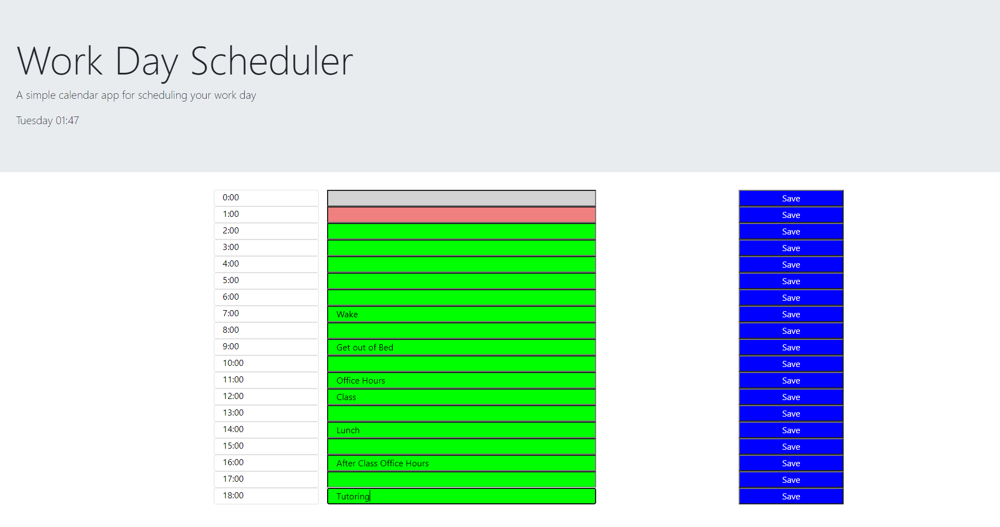

# mag-day-scheduler
<h1>Welcome to Work Day Scheduler</h1>

[Day Scheduler](https://magire01.github.io/mag-day-scheduler/)

 This app is a scheduler that allows you to enter an event for each hour, save it, and return to it while saving changes. If the event hour has passed, then the event will appear grey, if you are currently in the event hour, the event will appear coral, and if the event hour hasn't happened yet then the event will appear green. The user can change an event by entering/replacing the text and selecting the "Save" button next to the event. 

<h3> Known Issues </h3>
<ul> Time is currently showing in 24 hour format instead of AM/PM</ul>
<ul> Formatting issues on smaller screens/phones</ul>
 
 

 Author: Mark Gire 
